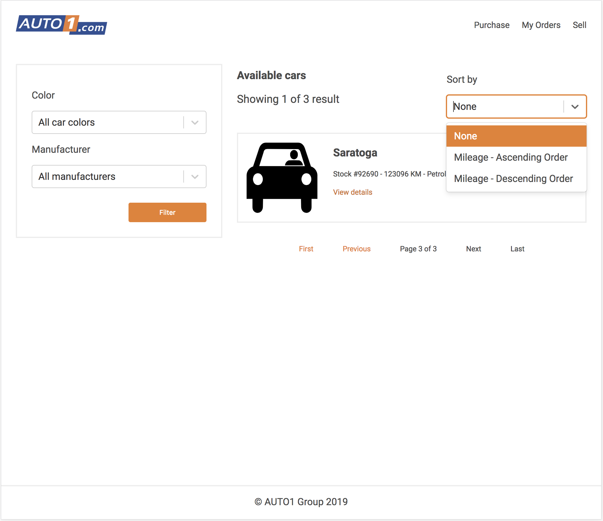

# Auto1 Group Car catalogue with seemless filtering capability.



### To run locally for development

```bash
  npm dev # This starts the backend and frontend concurrently.
```

### Run test

```bash
  npm test
```

### Build for production

```bash
  npm run build
```

## Features

- Aggregation filtering
- Pagination
- All functional components
- Redux-saga as redux middleware
- Use React Hooks
- CSS-in-JSS for styling.
- Unit tests: Components, Actions, Reducers, Sagas and store
- Code splitting
- Dynamic imports
- Super fast page loadtime
- Proper typechecking checking
- Responsive UI
- PWA support

Made with ❤️ by @rowlandekemezie.
